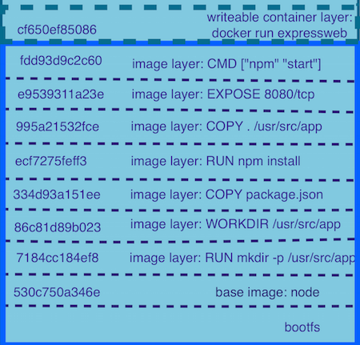

# 빌드 시간 단축을 위한 캐시 활용

## 한문단 설명

도커 이미지는 레이어의 조합이며 도커파일의 각 명령은 레이어를 생성합니다. 도커 데몬은 명령어가 동일하거나 `COPY`나 `ADD` 파일이 동일한 경우 빌드 사이의 해당 레이어를 재사용할 수 있다. ⚠️ 캐시가 특정한 레이어에서 사용될 수 없으면 모든 후속 레이어들도 무효화된다. 그래서 순서가 중요하다. 빌드에서 움직이는 부분의 수를 줄이려면 도커파일을 바르게 레이아웃 하는 것이 중요하다. 덜 갱신된 명령어는 위쪽에 있어야 하고 (앱 코드 같이) 지속적으로 수정되는 명령어는 아래쪽에 있어야 한다. 긴 작업 트리거하는 명령어는 실제로 필요할 때(도커 이미지가 빌드할 때마다 변경되지 않는다면)만 일어나도록 위쪽과 가까워야 하다고 생각하는 것도 중요하다. 캐시에서 전체 도커 이미지를 다시 빌드하는 것은 바르게 실행되면 거의 즉각적일 수 있다.



* [Digging into Docker layers](https://medium.com/@jessgreb01/digging-into-docker-layers-c22f948ed612)로 부터 가져온 이미지 by jessgreb01*

### 규칙

#### 계속 변하는 LABEL은 피하라

도커파일 상단에서 빌드 번호가 포함된 라벨을 가지고 있다면 모든 빌드에서 캐시는 무효화된다.
```Dockerfile
#Beginning of the file
FROM node:10.22.0-alpine3.11 as builder

# Don't do that here!
LABEL build_number="483"

#... Rest of the Dockerfile
```

#### 좋은 .dockerignore 파일을 사용해라

[**보기: docker ignore의 중요성에서**](./docker-ignore.md)

docker ignore은 테스트 결과 보고서, 로그나 임시 파일 같은 캐시 로직을 손상시킬 수 있는 파일 복사를 피한다.

#### "system" 패키지를 먼저 설치해라

사용하는 모든 시스템 패키지를 가진 기본 도커 이미지를 생성하는 것을 추천한다. **정말로** `apt`,`yum`,`apk`나 그런 것들을 사용해서 패키지를 설차해야 한다면 첫 번째 명령어 중 하나여야 한다. 노드 앱을 빌드할 때마다 make, gcc나 g++를 다시 설치하고 싶지 않다. **오직 편리성만 위해서 패키지를 설치하지마라, 이것은 상용 앱이다.**

#### 첫째로, package.json과 lockfile만 추가해라

```Dockerfile
COPY "package.json" "package-lock.json" "./"
RUN npm ci
```

lockfile과 package.json 은 종종 적게 변경된다. 먼저 복사하면 캐시에 `npm install` 단계가 유지되고, 이는 귀중한 시간을 절약한다.

### 그러면 파일을 복사하고 빌드 단계를 실행해라 (필요하다면)

```Dockerfile
COPY . .
RUN npm run build
```

## 예시

### OS 의존성을 요구하는 node_modules 기본 예시
```Dockerfile
#Create node image version alias
FROM node:10.22.0-alpine3.11 as builder

RUN apk add --no-cache \
    build-base \
    gcc \
    g++ \
    make

USER node
WORKDIR /app
COPY "package.json" "package-lock.json" "./"
RUN npm ci --production
COPY . "./"


FROM node as app

USER node
WORKDIR /app
COPY --from=builder /app/ "./"
RUN npm prune --production

CMD ["node", "dist/server.js"]
```


### 빌드 단계 예시 (타입스크립트를 사용한 예시)
```Dockerfile
#Create node image version alias
FROM node:10.22.0-alpine3.11 as builder

RUN apk add --no-cache \
    build-base \
    gcc \
    g++ \
    make

USER node
WORKDIR /app
COPY "package.json" "package-lock.json" "./"
RUN npm ci
COPY . .
RUN npm run build


FROM node as app

USER node
WORKDIR /app
# Only copying the files that we need
COPY --from=builder /app/node_modules node_modules
COPY --from=builder /app/package.json .
COPY --from=builder /app/dist dist
RUN npm prune --production

CMD ["node", "dist/server.js"]
```

## 안전한 링크

Docker docs: https://docs.docker.com/develop/develop-images/dockerfile_best-practices/#leverage-build-cache
