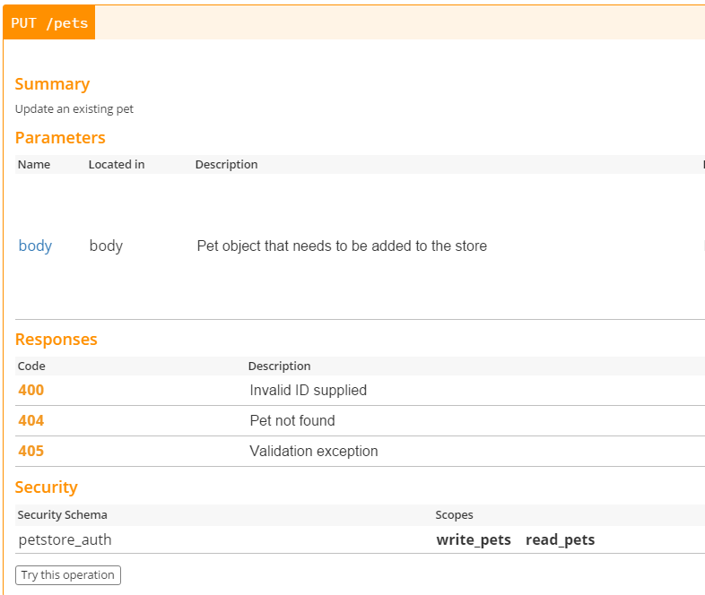

# Документація помилок API за допомогою OpenAPI Specification (раніше відомої як Swagger) або GraphQL

### Пояснення за один абзац

REST API повертає результати за допомогою HTTP-кодів статусу, це абсолютно необхідно для користувача API, щоб він був не тільки обізнаний зі схемою API, але й з потенційними помилками - так виклик можна впіймати та вдало обробити. Наприклад, в документації вашого API наперед може бути зазначено, що HTTP статус 409 повертається, коли ім'я клієнта вже існує (припускаючи, що API реєструє нових користувачів), отже викликаюча сторона може відповідно відобразити найкращий UX для даної ситуації. OpenAPI (aka Swagger) це стандарт, який визначає схему документації API, пропонуючи екосистему інструментів, які дозволяють легко створювати онлайн-документацію, дивіться скріншоти нижче.

Якщо ви вже використовували GraphQL для кінцевих точок вашого API, ваша схема вже містить строгі гарантії щодо того, якими повинні бути помилки (визначено в специфікації) і як їх повинна обробляти ваше клієнтське програмне забезпечення. Додатково, ви також можете доповнювати їх документацією на основі коментарів.

### Приклад помилки GraphQL

> Цей приклад використовує [SWAPI](https://graphql.org/swapi-graphql), API Зоряних Воєн.

```graphql
# повинно зазнати невдачу, тому що id недійсний
{
  film(id: "1ZmlsbXM6MQ==") {
    title
  }
}
```

```json
{
  "errors": [
    {
      "message": "Немає запису в локальному кеші для https://swapi.co/api/films/.../",
      "locations": [
        {
          "line": 2,
          "column": 3
        }
      ],
      "path": [
        "film"
      ]
    }
  ],
  "data": {
    "film": null
  }
}
```

### Цитата з блогу: "Ви повинні повідомити своїм викликаючим про те, які помилки можуть трапитися"

З блогу Joyent, рангований 1 за ключовими словами «Node.js logging»

> Ми говорили про те, як обробляти помилки, але коли ви пишете нову функцію, як ви передаєте помилки коду, який викликав вашу функцію? ...Якщо ви не знаєте, які помилки можуть трапитися або не знаєте, що вони означають, то ваша програма не може бути правильною, окрім як випадково. Тож якщо ви пишете нову функцію, ви повинні повідомити своїм викликаючим про те, які помилки можуть трапитися і що вони означають...

### Корисний інструмент: Створювач онлайн документації Swagger

